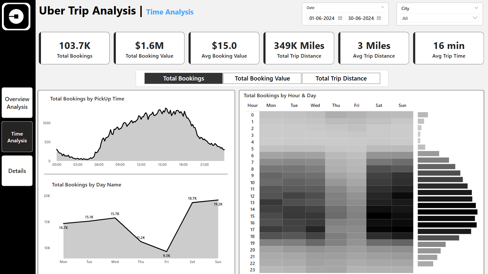

# Uber Trip Analysis Dashboard — Power BI

## 📍 Project Summary

This Power BI project delivers a full-scale business intelligence solution for analyzing Uber ride data. It helps business stakeholders uncover patterns in customer demand, revenue, trip distances, and location dynamics to support operational and strategic decisions.

---

## 🎯 Business Objectives

- Monitor booking volume and revenue trends
- Identify peak travel times for better resource planning
- Determine high-demand pickup and drop-off locations
- Optimize vehicle type distribution based on preferences
- Allow detailed data drill-through for granular insights

---

## 🗂️ Data Overview

| Table Name             | Description                                      |
|------------------------|--------------------------------------------------|
| `Uber Trip Details.xlsx`    | Contains booking ID, trip time, fare, vehicle ID, etc. |
| `Location Details.xlsx`| Includes location IDs and corresponding names     |

**Data Modeling Approach:**

- `Location ID` linked to **Pickup Point** (Active Relationship)
- `Drop-off Point` managed via **USERELATIONSHIP** in DAX (Inactive Relationship)
- A custom **Calendar Table** was built to support time-based analysis

### 🔗 [Data Model Schema (Click to View Full)](documentation/Data_Model_Schema.png)

---

## 📊 KPIs Tracked

| KPI                     | Description                                  |
|-------------------------|----------------------------------------------|
| Total Bookings          | Number of completed trips                    |
| Total Booking Value     | Total revenue generated                      |
| Average Booking Value   | Revenue per trip                             |
| Total Trip Distance     | Aggregate distance covered                   |
| Average Trip Distance   | Distance Per Trip                            |
| Average Trip Duration   | Operational efficiency indicator             |

---

## 🧠 Key Insights

- **Uber Pay** is the most preferred payment method, dominated by **UberX** usage
- **Penn Station** is the most frequent pickup and **Upper East Side North** is most frequent drop-off point
- **Peak demand occurs from 12 PM to 6 PM**, especially on **weekends**
- With vehicle inventory data, **supply-demand optimization** would have been possible

---

## 📈 Dashboards Built

### 1. **Overview Dashboard**
- Dynamic KPI selector (Bookings, Revenue, Distance)
- Filters for Date and Ciry (Can be optimized according to requirements)
- Vehicle-wise performance with conditional formatting
- Top PickUp and Droff point
- Location wise booking count

### 📊 Overview Dashboard

### 2. **Time Analysis Dashboard**
- Area chart showing trip volume by 10-minute intervals
- Area chart showing bookings by weekday
- Heatmap (Hour × Day) to spot demand patterns

### ⏱️ Time Analysis Dashboard

### 3. **Details Dashboard**
- Grid table with full trip-level data
- Drill-through from visual insights to raw records
- Bookmarks for toggling between filtered and full data view

### 📋 Detailed Grid Tab

---

## 🛠️ Tools & Techniques Used

- **Power BI Desktop**
- **DAX**:
  - `CALCULATE`, `USERELATIONSHIP`, `SWITCH`, `SUMMARIZE`, `RANKX`, `VAR`
- **Modeling**:
  - Disconnected table for dynamic measures
  - Inactive relationship for drop-off analysis
- **UX Features**:
  - Bookmarks, drill-through, clear filters, export to CSV
  - Conditional formatting for high/low performance

---

## 📈 Future Enhancements

- Integrate **weather/events API** to correlate with ride volume
- Use **Power BI's Key Influencers** visual for pricing impact
- Add **forecasting** and **anomaly detection** to pre-empt demand
- Apply **Row Level Security (RLS)** for city-level access
- Optimize large data refresh using **incremental load**

---

## 💼 Why This Project Is Valuable

This project simulates a real-world business scenario. It showcases my ability to:
- Translate raw operational data into actionable insights
- Build performance-optimized, user-friendly dashboards
- Apply DAX and Power BI best practices to solve business problems
- Think from both **data** and **decision-maker** perspectives

---

## 📬 Contact

For questions, collaboration, or portfolio review:

📧 prateekkumarprasad15@gmail.com  
🔗 [LinkedIn](https://www.linkedin.com/in/prateekkp/)

